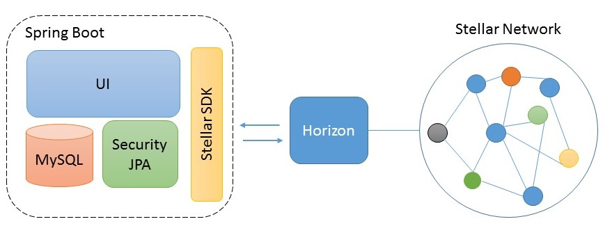

# Banking on Blockchain with Stellar - Tutorial

## What is Stellar?

According to [Stellar.org](https://www.stellar.org/) : Stellar is open-source, distributed payments infrastructure. Using the Stellar network, you can build mobile wallets, banking tools, smart devices that pay for themselves, and just about anything else you can dream up involving payments! Even though Stellar is a complex distributed system, working with it doesn’t need to be complicated.

## What will we build in this tutorial

This is a tutorial for creating a simple banking application with [Stellar's](https://www.stellar.org/) hybrid blockchain and Lumen (XLM) as currency.
The following topics are covered in this tutorial:
1. Working with Stellar Java SDK
2. Creating a Stellar Bank UI using Spring Boot, Spring Security and MySql
3. Open an Account and fund 10,000 XLM 
4. Open another account and transfer 100 XLM (or any amount)from one account to another
5. View account details and blalances

## Getting Started



Most applications interact with the Stellar network through Horizon, a RESTful HTTP API server. Horizon gives you a straightforward way to submit transactions, check accounts, and subscribe to events. The Java Stellar Sdk library provides APIs to build transactions and connect to Horizon.

For this tutorial we will be using the test network :  https://horizon-testnet.stellar.org. 
The test network allows us to create new accounts and seed them with 10,000 Lumens(XLM) to play with.

### Download the SDK 

Download the SDK from [Stellar.org](https://github.com/stellar/java-stellar-sdk) to your local file system.

Notice that this a jar file that needs to be imported into your local Maven repo before we can use it in our project as a dependency.


### Import the jar into your local Maven repo

Use the following command to import the SDK jar file into your Maven repo:

```
mvn install:install-file -Dfile=/<path to the sdk jar> -DgroupId=<package name> -DartifactId=<packageId> -Dversion=<version> -Dpackaging=jar

```

For example :

```
mvn install:install-file -Dfile=/Users/sunil_vishnubhotla/Downloads/stellar-sdk.jar -DgroupId=com.stellar.code -DartifactId=stellar -Dversion=0.1.14 -Dpackaging=jar

```


Then add the dependancy in your pom.xml file like so :

```
<dependency>
     <groupId>com.stellar.code</groupId>
     <artifactId>stellar</artifactId>
     <version>0.1.14</version>
</dependency>

```

Note: this dependancy is already added in the source pom.xml.

### Installing

To run the sample, install Maven, Java 1.8+, MySql and download the code. 
Edit the application.properties file to setup your DB connection.

And simply run this command in the source root


```
mvn springboot:run
```

And point your browser to 

```
http://localhost:8080
```

login screen :


Asuming your DB is up and running, you should see the login screen. As a first time user, go ahead and click the "Join us" link to create a new user and get 10,000 Lumens depositted into your account.
All this happens in the AccountService.java class as shown below:

```
KeyPair pair = KeyPair.random();
String seed = new String(pair.getSecretSeed());
key = pair.getAccountId();
String friendbotUrl = String.format(friendbot, key);

response = new URL(friendbotUrl).openStream();
String body = new Scanner(response, "UTF-8").useDelimiter("\\A").next();
System.out.println("New Stellar account created :)\n" + body);

Account acc = new Account(key, seed, name, email);
accountRepository.save(acc);
```
We start by calling the Stellar SDK's KeyPair object's random() method that generates and assigns our accout a unique key pair.
Each account has a privete key also called the secret seed and a public key that is assigned when you create a Stellsr account.
As with any blockchain implementation, you need a private key to sign all your transactions to ensure they orignate from you and that  no one else can tamper with it. You do not share your privete key(hence the word private) with anyone but you do send the public key along with the transaction for the system to verify it was you who started the transaction and that you have the needed funds to carry out the transaction.

We then seed this account using the Stellar's Friendbot service to give us 10,000 XLMs.


## Built With

* [Stellar SDK](https://github.com/stellar/java-stellar-sdk) - Stellar's Java SDK
* [Spring Boot](https://projects.spring.io/spring-boot/) - The web framework used
* [Spring Security](https://projects.spring.io/spring-security/) - User authentication
* [Spring Data JPA](https://projects.spring.io/spring-data-jpa//) - Data access layer
* [Maven](https://maven.apache.org/) - Dependency Management
* [MySql](https://rometools.github.io/rome/) - RDBMS

## Contributing

Please read [CONTRIBUTING.md](CONTRIBUTING.md) for details on our code of conduct, and the process for submitting pull requests to us.

## Versioning

We use [TBD](http://tbd.org/) for versioning. For the versions available, see the [tags on this repository](https://github.com/your/project/tags). 

## Authors

* **Sunil Vishnubhotla** - *Initial work* - [sunilvb](https://github.com/sunilvb)

See also the list of [contributors](https://github.com/your/project/contributors) who participated in this project.

## License

This project is licensed under the MIT License - see the [LICENSE.md](LICENSE.md) file for details

## Acknowledgments

* Hat tip to anyone who's code was used
* Inspiration
* etc

## Donations :
XLM = > GCFV72GPGTP7QY5HZUE5YGFO5LZ3PXO6Q7OGT6VKZZFBQ2AO62THYJA5
